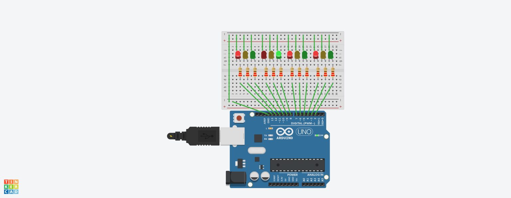

# 🚦 Traffic Light 4 Arah Menggunakan Arduino Uno

## Overview
Project ini merupakan simulasi **lampu lalu lintas (Traffic Light) 4 Arah** menggunakan Arduino Uno. Tujuan dari project ini adalah untuk memenuhi tugas mata kuliah Pemrograman Sistem Tertanam, serta memahami konsep dasar pemrograman mikrokontroler, penggunaan GPIO (General Purpose Input Output), pengaturan waktu (timing), dan modularisasi fungsi.

Pada project ini, 12 buah LED digunakan untuk merepresentasikan lampu lalu lintas di 4 persimpangan (Utara, Timur, Selatan, Barat):
- 🔴 Merah (Berhenti)
- 🟡 Kuning (Bersiap/Transisi)
- 🟢 Hijau (Jalan)

## Objectives
Tujuan dari project ini adalah:
- Memahami dasar penggunaan Arduino dan mikrokontroler.
- Mempelajari cara mengontrol banyak LED menggunakan pin digital.
- Mengimplementasikan logika sekuensial dan delay waktu yang spesifik.
- Mencegah konflik antar simpang sehingga tidak ada lebih dari satu sisi hijau yang menyala secara bersamaan.

## Components Required
Komponen yang digunakan pada project ini antara lain:
- 1x Arduino Uno
- 12x LED (4 Merah, 4 Kuning, 4 Hijau)
- 12x Resistor 220Ω
- 1x Small Breadboard
- Jumper wires secukupnya

## Circuit Diagram & Simulasi
Berikut adalah dokumentasi penempatan komponen pada breadboard:

**Tautan Simulasi Tinkercad:**
[Klik di sini untuk melihat dan menjalankan simulasi Tinkercad](https://www.tinkercad.com/things/kTFTHwuTVC7/editel?returnTo=%2Fdashboard%2Fdesigns%2Fall&sharecode=p8q4D4AeNDiiqKc45RkcXgpywB80tPRlx60nU5eM67k](https://www.tinkercad.com/things/kTFTHwuTVC7-tugas-3?sharecode=C02i2zFdJkw4TnVZ3MINKouLtHkEbLrHwbC9EG3XB-w)

Setiap LED dihubungkan ke pin digital Arduino (Pin 2 hingga Pin 13) dan dihubungkan ke ground melalui resistor untuk membatasi arus.

## How It Works
Program Arduino akan menyalakan LED secara bergantian berputar searah jarum jam (Utara → Timur → Selatan → Barat). Kondisi default awal sebelum siklus berjalan adalah semua lampu berwarna MERAH.

Urutan siklus pada setiap simpang yang aktif:
1. Lampu **Hijau menyala** selama 5 detik.
2. Lampu **Kuning berkedip** 3 kali, kemudian menyala stabil selama 2 detik.
3. Lampu **Merah menyala** kembali setelah siklus hijau dan kuning selesai.

Siklus ini akan terus berulang (looping) ke simpang berikutnya secara otomatis.

## Learning Outcomes
Setelah menyelesaikan project ini, diharapkan pengguna dapat memahami:
- Dasar pemrograman Arduino untuk sistem kontrol multi-arah.
- Penggunaan pin digital sebagai output secara efisien.
- Pembuatan fungsi (modular code) untuk menyederhanakan logika program.
- Konsep otomasi dan pengaturan waktu pada sistem keselamatan lalu lintas.
